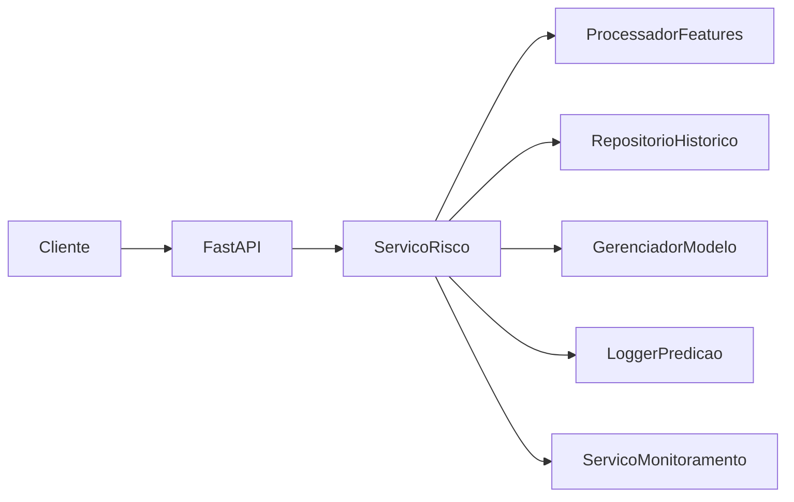
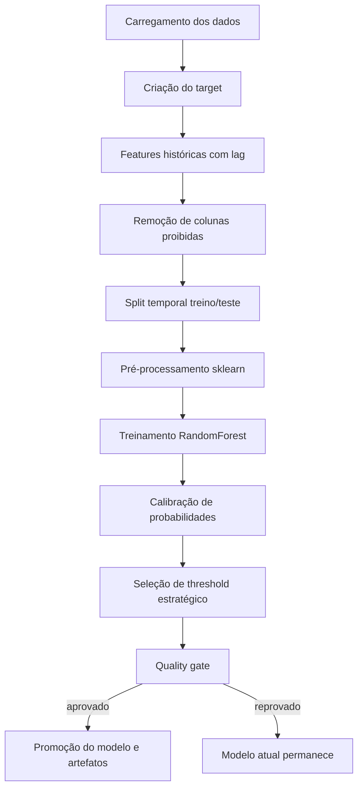
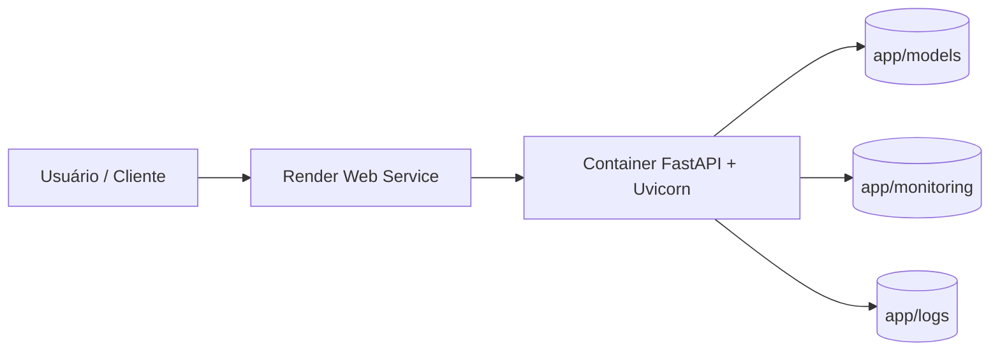
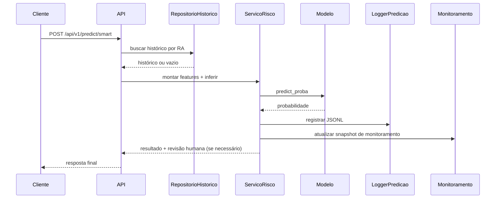

[](https://www.python.org/)
[](https://fastapi.tiangolo.com/)
[](https://scikit-learn.org/)
[](https://onenr.io/0yw49WynLR3)
[](https://www.docker.com/)
[](https://passos-magicos-datathon.onrender.com/docs#/)

# Datathon Tech5 | Sistema de Classificação de Risco de Defasagem Escolar

> Documento técnico oficial de entrega (whitepaper + guia operacional + guia de deploy).
## Índice

- [1) Visão Geral do Projeto](#1-visão-geral-do-projeto)
- [2) Sobre a Associação Passos Mágicos](#2-sobre-a-associação-passos-mágicos)
- [3) O Que a Aplicação É](#3-o-que-a-aplicação-é)
- [4) Por Que Cada Decisão Técnica Foi Tomada](#4-por-que-cada-decisão-técnica-foi-tomada)
- [5) Solução Proposta (Pipeline Completa)](#5-solução-proposta-pipeline-completa)
- [6) Stack Tecnológica](#6-stack-tecnológica)
- [7) Estrutura do Projeto](#7-estrutura-do-projeto)
- [8) Deploy e Execução](#8-deploy-e-execução)
- [9) Link do Vídeo de Apresentação](#9-link-do-vídeo-de-apresentação)
- [10) Exemplos de Chamadas à API](#10-exemplos-de-chamadas-à-api)
- [11) Sistema em Produção](#11-sistema-em-produção)
- [12) O Que o Dashboard de Observabilidade Oferece](#12-o-que-o-dashboard-de-observabilidade-oferece)
- [13) Métricas Reais Observadas](#13-métricas-reais-observadas)
- [14) Cenários Reais de Exposição](#14-cenários-reais-de-exposição)
- [15) Limitações](#15-limitações)
- [16) Perguntas Relevantes](#16-perguntas-relevantes)
- [17) Hands-on (Guia Pratico)](#17-hands-on-guia-pratico)
- [18) Licença MIT](#18-licença-mit)

---

## 1) Visão Geral do Projeto

### O problema que o projeto resolve
A operação educacional precisa identificar, com antecedência, estudantes com maior probabilidade de defasagem escolar, para que a intervenção aconteça no momento em que ainda é possível evitar agravamento acadêmico.

Na prática, o desafio não é apenas prever risco, mas transformar dados históricos em priorização operacional acionável, sem depender exclusivamente de triagem manual e sem comprometer a segurança de decisão em casos ambíguos.

### Por que esse problema é relevante
- o tempo de resposta pedagógica impacta diretamente a chance de recuperação do estudante;
- equipes têm capacidade limitada de acompanhamento e precisam de critério objetivo de prioridade;
- abordagens reativas tendem a consumir recursos tarde demais, com menor efetividade;
- decisões sem rastreabilidade dificultam governança, auditoria e melhoria contínua.

Em contexto de vulnerabilidade social, o custo de não agir cedo é alto para o aluno, para a equipe educacional e para a instituição.

### Valor funcional entregue pela solução
O sistema implementa um fluxo de ML ponta a ponta preparado para operação real:
- predição online de risco (`/api/v1/predict/full` e `/api/v1/predict/smart`);
- tratamento de cold start com revisão humana obrigatória quando não há histórico;
- monitoramento contínuo de estabilidade (drift via PSI);
- retreinamento controlado por quality gate para reduzir risco de regressão;
- logging estruturado para rastreabilidade técnica e análise posterior.

### Valor real para a operação
Com o uso do sistema, a operação sai de um modelo majoritariamente reativo para um modelo preventivo orientado por probabilidade de risco:
- a fila de atendimento passa a refletir criticidade real dos casos;
- casos limítrofes e novos alunos são sinalizados para decisão assistida por humano;
- a coordenação ganha previsibilidade de demanda e base objetiva para alocação de recursos;
- a gestão passa a acompanhar sinais de degradação do modelo antes de impacto severo.

### Objetivo estratégico do projeto
Transformar dados acadêmicos em decisão operacional confiável, equilibrando performance preditiva e governança técnica:
- controle de leakage temporal;
- calibração de probabilidade para decisão prática;
- monitoramento de drift e fairness;
- critério mínimo de qualidade para promoção de novos modelos.

### O que muda na prática (antes vs depois)
Antes:
- priorização manual, heterogênea e frequentemente tardia;
- baixa rastreabilidade dos critérios usados para intervenção.

Depois:
- priorização orientada por risco com critérios explícitos e auditáveis;
- intervenção mais cedo nos casos críticos;
- ciclo contínuo de monitoramento e melhoria do modelo em produção.

---

## 2) Sobre a Associação Passos Mágicos

A **Associação Passos Mágicos** atua no desenvolvimento educacional de crianças e jovens em situação de vulnerabilidade.

- Site oficial: https://passosmagicos.org.br/
- Conexão com o projeto: o sistema apoia diretamente a missão institucional ao antecipar risco de defasagem e melhorar a priorização de acompanhamento educacional.

---

## 3) O Que a Aplicação É

A solução é um **sistema completo de ML em produção candidata**, composto por:

| Componente | O que faz | Evidência no código |
|---|---|---|
| API de inferência | Expõe predição completa e predição inteligente com histórico | `app/main.py`, `app/src/api/controller.py` |
| Pipeline de treinamento | Treina modelo com anti-leakage temporal, calibração e threshold estratégico | `app/train.py`, `app/src/infrastructure/model/ml_pipeline.py` |
| Sistema de retreinamento | Endpoint para acionar treino e recarregar modelo em memória | `app/src/api/training_controller.py`, `app/src/application/training_service.py` |
| Monitoramento | Drift (PSI), métricas estratégicas e persistência de relatório | `app/src/application/monitoring_service.py` |
| Governança de fairness | Estratégia de threshold com restrições + monitoramento de FPR/FNR por grupo | `app/src/infrastructure/model/ml_pipeline.py`, `app/src/application/monitoring_service.py` |
| Cold start | Fallback para aluno sem histórico com revisão humana obrigatória | `app/src/application/risk_service.py` |
| Controle de promoção | Quality gate por recall mínimo e comparação com baseline em produção | `app/src/infrastructure/model/ml_pipeline.py` |
| Logging estruturado | Persistência JSONL de predições em formato técnico | `app/src/infrastructure/logging/prediction_logger.py` |
| Observabilidade executiva | Dashboard no New Relic com visão consolidada de modelo e aplicação | seção `Observability & Monitoring` |

### Arquitetura resumida



---

## 4) Por Que Cada Decisão Técnica Foi Tomada

| Decisão | Motivo técnico | Impacto operacional |
|---|---|---|
| Split temporal por `ANO_REFERENCIA` | Evitar vazamento de futuro | Métricas mais confiáveis para produção |
| Features lag por aluno (`shift(1)`) | Capturar histórico sem leakage | Melhor sinal de risco longitudinal |
| Remoção de colunas proibidas no treino | Evitar target leakage implícito | Redução de risco de superestimação de performance |
| `RandomForestClassifier` balanceado | Robustez e menor sensibilidade a escala/ruído | Bom compromisso entre recall e estabilidade |
| Calibração (`none/sigmoid/isotonic`) | Melhorar qualidade probabilística | Probabilidade mais útil para decisão operacional |
| Threshold estratégico | Ajustar trade-off risco de FN/FP por estratégia | Modelo alinhado ao objetivo do negócio |
| Quality gate de promoção | Evitar regressão silenciosa em produção | Controle mínimo de qualidade antes de promover |
| Cold start com revisão humana | Evitar decisão automática cega sem histórico | Segurança operacional para novos alunos |
| Monitoramento PSI + New Relic | Detectar mudança de distribuição | Gatilhos antecipados de revisão de modelo |
| Logs JSONL estruturados | Rastreabilidade e auditoria | Base para observabilidade e pós-análise |

---

## 5) Solução Proposta (Pipeline Completa)

Fluxo implementado de ponta a ponta:

1. **Pré-processamento**: normalização de tipos, imputação e padronização de colunas.
2. **Engenharia de features**: `TEMPO_NA_ONG`, métricas históricas (`*_ANTERIOR`) e `ALUNO_NOVO`.
3. **Criação de target**:
   - prioridade 1: `DEFASAGEM < 0`
   - prioridade 2: `INDE < 6.0`
   - prioridade 3: `PEDRA` contendo `QUARTZO`
4. **Anti-leakage**: remoção explícita de `INDE`, `PEDRA`, `DEFASAGEM`, notas.
5. **Split temporal**: treino com anos anteriores e teste no último ano.
6. **Treinamento**: pipeline sklearn + `RandomForestClassifier`.
7. **Validação**: métricas holdout e baseline majoritário.
8. **Calibração**: seleção de melhor método por Brier no split interno de treino.
9. **Threshold**: seleção por estratégia (`f1`, `recall`, `cost`, `fairness_f1`).
10. **Quality gate**: bloqueia promoção com recall abaixo do mínimo e regressão severa de F1.
11. **Persistência**: modelo, backup, métricas, referência de monitoramento e estatísticas.
12. **Deploy via API**: inferência online com saúde (`/health`) e monitoramento operacional.

### Desenho da pipeline de ML



---

## 6) Stack Tecnológica

| Camada | Tecnologia |
|---|---|
| Linguagem | Python 3.x (Docker em Python 3.11) |
| ML/Data | scikit-learn, pandas, numpy |
| API | FastAPI + Uvicorn |
| Persistência de modelo | joblib |
| Testes | pytest |
| Containerização | Docker + Docker Compose |
| Observabilidade técnica | logging + JSONL |
| Drift monitoring | PSI custom |
| Deploy | Local e cloud-ready (containerizado) |

---

## 7) Estrutura do Projeto

```text
datathon-tech5/
├── app/
│   ├── data/                 # Dataset fonte (.xlsx)
│   ├── logs/                 # Logs de inferência (JSONL)
│   ├── models/               # Modelo ativo e backup (.joblib)
│   ├── monitoring/           # Métricas, referência e drift
│   ├── src/
│   │   ├── api/              # Controladores FastAPI
│   │   ├── application/      # Regras de negócio (risco, treino e monitoramento)
│   │   ├── config/           # Configurações centrais
│   │   ├── domain/           # Contratos Pydantic
│   │   ├── infrastructure/   # Dados, modelo e logging técnico
│   │   └── util/             # Logger da aplicação
│   ├── main.py               # Entrada da API
│   └── train.py              # Entrada do pipeline de treino
├── tests/
│   ├── scripts/              # Simulação de tráfego de produção
│   └── unit/                 # Suíte unitária e integração local
├── Dockerfile
├── docker-compose.yml
├── requirements.txt
├── RELATORIO_TECNICO_COMPLETO.md
└── BLOCO_DEFESA_BANCA.md
```

---

## 8) Deploy e Execução

### Ambiente Local

#### Pré-requisitos
- Python 3.11+
- `pip`
- (Opcional) ambiente virtual

#### Instalação

```bash
pip install -r requirements.txt
```

#### Execução da API

```bash
cd app
python main.py
```

Acessos:
- Health: `http://localhost:8000/health`
- OpenAPI: `http://localhost:8000/docs`
- Observabilidade principal (New Relic): `https://onenr.io/0yw49WynLR3`
- JSON local do dashboard (import manual): `observability/newrelic-dashboard-local.json`

#### Treinamento local

```bash
cd app
python train.py
```

#### Testes

```bash
PYTHONPATH=app pytest -q -p no:cacheprovider
```

Resultado validado no repositório: **119 passed, 2 warnings**.

### Docker

#### Build

```bash
docker build -t passos-magicos:local .
```

#### Run

```bash
docker run --rm -p 8000:8000 passos-magicos:local
```

#### Docker Compose

```bash
docker compose up --build
```

### Deploy em Produção (Render)

**Declaração de deploy**:
- A aplicação está hospedada no **Render**.
- O deploy é **containerizado** via `Dockerfile`.

**Arquitetura simplificada de deploy**:
- Render Web Service -> Container FastAPI/Uvicorn -> volume lógico de artefatos (`models`, `monitoring`, `logs`).

### Desenho de arquitetura de deploy



**URL pública da aplicação**:
- API: https://passos-magicos-datathon.onrender.com/docs#/
- Health: https://passos-magicos-datathon.onrender.com/health
- Observabilidade principal (New Relic): https://onenr.io/0yw49WynLR3

---

## 9) Link do Vídeo de Apresentação

### 🎥 Vídeo de Apresentação do Projeto
[Link para o vídeo no YouTube]

---

## 10) Exemplos de Chamadas à API

### Tabela de endpoints

| Método | Endpoint | Descrição |
|---|---|---|
| `GET` | `/health` | Saúde do serviço e disponibilidade do modelo |
| `POST` | `/api/v1/predict/full` | Predição com payload completo |
| `POST` | `/api/v1/predict/smart` | Predição com enriquecimento por histórico |
| `POST` | `/api/v1/train/retrain` | Retreinamento e reload do modelo |
| `GET` | `/api/v1/monitoring/feature-importance` | Ranking global de importância |

### `curl` reais

```bash
curl -X GET http://localhost:8000/health
```

```bash
curl -X POST http://localhost:8000/api/v1/predict/smart \
  -H "Content-Type: application/json" \
  -d '{
    "RA": "123",
    "IDADE": 10,
    "ANO_INGRESSO": 2020,
    "GENERO": "Masculino",
    "TURMA": "A",
    "INSTITUICAO_ENSINO": "Escola",
    "FASE": "1A",
    "ANO_REFERENCIA": 2024
  }'
```

```bash
curl -X POST http://localhost:8000/api/v1/train/retrain
```

### Exemplo de retorno (`/predict/smart`)

```json
{
  "risk_probability": 0.6998,
  "risk_label": "ALTO RISCO",
  "prediction": 1,
  "requires_human_review": false,
  "risk_segment": "ALTO_RISCO",
  "top_risk_drivers": [
    "queda no IEG_ANTERIOR",
    "desempenho histórico baixo no INDE_ANTERIOR"
  ]
}
```

---

## 11) Sistema em Produção

### Cold start
- Aluno sem histórico recebe baseline histórico zerado.
- `ALUNO_NOVO=1` e `requires_human_review=true`.

### Retreinamento
- Endpoint síncrono: `POST /api/v1/train/retrain`.
- Fluxo: carga de dados -> treino -> promoção (se passar quality gate) -> reload em memória.

### Versionamento
- Modelo ativo: `app/models/model_passos_magicos.joblib`
- Backup: `app/models/model_passos_magicos.joblib.bak`
- Versão registrada em `train_metrics.json`.

### Monitoramento
- Drift com PSI custom.
- Relatório consolidado em `app/monitoring/drift_report.json`.

### Fairness
- `GENERO` fora das features preditivas.
- Monitoramento por grupo com FPR/FNR.
- Estratégia opcional de threshold com constraints de fairness.

### Logs
- Predições em `app/logs/predictions.jsonl` (estrutura JSONL, com `prediction_id`, `timestamp`, input e resultado).

### Persistência histórica
- Referência para monitoramento em `app/monitoring/reference_data.csv`.
- Estatísticas de imputação em `app/monitoring/feature_stats.json`.

### Desenho do fluxo de inferência (`predict/smart`)



---

## 12) O Que o Dashboard de Observabilidade Oferece

O dashboard no New Relic consolida:

- **Data drift**: mudança de distribuição das features.
- **Target drift (quando disponível)**: desvio no comportamento do alvo ao longo do tempo.
- **PSI por feature**: intensidade do drift com ranking de features críticas.
- **Alertas automáticos**: sinalização por limiares de PSI e variação estratégica.
- **Evolução histórica**: séries de `avg_psi` e taxa de ALTO_RISCO.
- **Taxa ALTO_RISCO**: referência vs produção com delta percentual e em p.p.
- **Indicador estratégico de estabilidade**: status consolidado (`Estavel`, `Moderado`, `Critico`).
- **Fairness por grupo**: FPR/FNR por grupo sensível.
- **Consolidação executiva**: visão final para decisão de operação e governança.

### Como isso auxilia gestores
- antecipa risco de sobrecarga de atendimento;
- justifica ajustes de threshold com base em dados;
- acelera decisão de retreino e mitigação de risco operacional.

---

## 13) Métricas Reais Observadas

Fonte: `app/monitoring/train_metrics.json` (timestamp: `2026-02-17T13:37:16.207589`)

| Métrica | Valor |
|---|---|
| Recall | **0.8333** |
| Precision | **0.6096** |
| F1-score | **0.7041** |
| AUC | **0.7239** |
| Brier score | **0.2181** |
| Threshold de risco | **0.5015** |
| Estratégia de threshold | **f1** |
| Train size | **1874** |
| Test size | **1156** |
| Overfitting gap (F1 treino - teste) | **0.1863** |

Baseline majoritário no holdout:
- F1: **0.6320**
- Recall: **1.0000**
- Precision: **0.4619**

### Interpretação técnica
- há ganho de F1 sobre baseline;
- recall alto sustenta objetivo de captura de risco;
- precision moderada mantém necessidade de revisão humana operacional;
- gap de overfitting é não trivial e deve ser monitorado.

### Drift atual (artefato real)
Fonte: `app/monitoring/drift_report.json` (timestamp: `2026-02-17T15:45:16.790997`)

- `drift_status`: **Estavel**
- `psi_metrics_count`: **5**
- Top PSI: `IDADE=0.0455`, `TEMPO_NA_ONG=0.0310`, `INDE_ANTERIOR=0.0269`
- Taxa ALTO_RISCO referência -> atual: **63.15% -> 63.30%** (delta **+0.15 p.p.**)

### Fairness (holdout de referência)
Cálculo sobre `app/monitoring/reference_data.csv`:
- Gap FPR por `GENERO`: **13.0 p.p.**
- Gap FNR por `GENERO`: **3.5 p.p.**

---

## 14) Cenários Reais de Exposição

| Cenário | Comportamento atual do sistema | Resposta esperada da operação |
|---|---|---|
| Aluno novo (sem histórico) | Fallback + `requires_human_review=true` | Revisão humana prioritária |
| Drift de dados | PSI e status de drift atualizados | Investigar fonte de mudança e impacto |
| Mudança de distribuição | Variação em taxa ALTO_RISCO e `top_drift_features` | Recalibrar threshold e/ou retreinar |
| Piora de recall | Quality gate bloqueia promoção abaixo de `MIN_RECALL` | Revisar modelo e política de threshold |
| Falha de modelo em runtime | `/health` retorna `503` quando indisponível | Acionar contingência/rollback |
| Dados inconsistentes de entrada | Validação Pydantic + normalização em processamento | Corrigir qualidade upstream e monitorar incidência |


---

## 15) Limitações

Limitações observáveis no código e artefatos:
- Sem autenticação/autorização nativas na API.
- Sem rate limiting efetivo implementado no app (apesar de variáveis no compose).
- Sem orquestração automática de retreino/CI-CD MLOps completo.
- Sem tracking formal de experimentos/lineage.
- Fairness online completo depende de enriquecimento posterior com rótulo real.
- `ANO_INGRESSO` com limite fixo em validação (`<= 2026`), exigindo manutenção anual.
- As trilhas de clusterização e LLM não estão implementadas em produção neste código.

---

## 16) Perguntas Relevantes

### 1) Como o código evita data leakage?
Com split temporal por `ANO_REFERENCIA`, features históricas via `shift(1)` e exclusão explícita de colunas vazadoras (`INDE`, `PEDRA`, `DEFASAGEM`, notas) antes do treino.

### 2) Como o threshold foi escolhido e por quê?
O pipeline suporta `f1`, `recall`, `cost`, `fairness_f1`. O modelo promovido atual usa `f1` com threshold `0.5015`, buscando equilíbrio entre captura de risco e custo operacional de falsos positivos.

### 3) Como o código trata aluno sem histórico?
Há cold start determinístico: histórico zerado, `ALUNO_NOVO=1` e marcação de `requires_human_review=true`, evitando decisão automática sem contexto.

### 4) Como monitorar drift na prática?
Com PSI custom, persistindo `drift_report.json` com métricas por feature, alertas, status consolidado e histórico da taxa de ALTO_RISCO.

### 5) Fairness está resolvido?
Não completamente. Há mecanismos de governança (exclusão de feature sensível no modelo, monitoramento por grupo e estratégia de threshold com constraints), mas o artefato atual mostra gap de FPR de 13.0 p.p., exigindo mitigação contínua.

### 6) O que impede regressão de modelo em retreino?
Quality gate: bloqueio por recall mínimo e critério de não degradação relevante de F1 frente ao baseline em produção.

---

## 17) Hands-on (Guia Pratico)

### Roteiro rápido (15-20 min)

1. Instale dependências.

```bash
pip install -r requirements.txt
```

2. Suba a API localmente.

```bash
cd app
python main.py
```

3. Valide saúde da aplicação.

```bash
curl -X GET http://localhost:8000/health
```

4. Execute uma predição inteligente.

```bash
curl -X POST http://localhost:8000/api/v1/predict/smart \
  -H "Content-Type: application/json" \
  -d '{
    "RA": "1001",
    "IDADE": 11,
    "ANO_INGRESSO": 2021,
    "GENERO": "Feminino",
    "TURMA": "1A",
    "INSTITUICAO_ENSINO": "Publica",
    "FASE": "1A",
    "ANO_REFERENCIA": 2024
  }'
```

5. Rode retreinamento via endpoint.

```bash
curl -X POST http://localhost:8000/api/v1/train/retrain
```

6. Abra o dashboard de observabilidade no New Relic.

7. (Opcional) execute a simulação de produção para alimentar logs.

```bash
PYTHONPATH=app python tests/scripts/send_production_simulation.py --max-requests 50
```

### Checklist de validação prática

- `/health` retorna `{"status":"ok"}`.
- `predict/smart` retorna `risk_probability`, `risk_segment` e `requires_human_review`.
- `train/retrain` retorna status de sucesso.
- `app/logs/predictions.jsonl` cresce após chamadas de predição.
- `app/monitoring/drift_report.json` é atualizado.

---

## Observability & Monitoring

### New Relic APM integration

- A API é executada com `newrelic-admin run-program uvicorn ...` no container.
- Com isso, todos os endpoints FastAPI passam a ter monitoramento APM automático:
  latência, throughput, taxa de erro e traces distribuídos.
- O agente usa variáveis de ambiente, sem chave hardcoded:
  - `NEW_RELIC_LICENSE_KEY`
  - `NEW_RELIC_APP_NAME`
  - `NEW_RELIC_LOG_LEVEL=info`
- Logs do agente são enviados para `stderr` (`NEW_RELIC_LOG=stderr`).

### Custom model metrics (PSI + New Relic)

- Quando um snapshot de monitoramento é gerado (drift/PSI), o projeto publica eventos customizados no New Relic:
  - `ModelMonitoringSnapshot` (visão consolidada)
  - `ModelMonitoringPsiFeature` (PSI por feature)
  - `ModelMonitoringPerformance` (recall/precision/F1/AUC/Brier/threshold)
  - `ModelMonitoringThresholdStrategy` (comparação de estratégias de limiar)
  - `ModelMonitoringFairnessGroup` (métricas por grupo de fairness)
  - `ModelMonitoringFeatureImportance` (top features de importância global)
- O envio é protegido por `try/except`, não interrompe o fluxo da API e falha de forma segura.
- Dashboard recomendado (import manual local): `observability/newrelic-dashboard-local.json`

Exemplos de NRQL:

```sql
SELECT count(*) FROM ModelMonitoringSnapshot SINCE 30 minutes ago
```

```sql
SELECT latest(drift_score), latest(risk_rate), latest(drift_status)
FROM ModelMonitoringSnapshot
SINCE 60 minutes ago
```

```sql
SELECT average(psi) FROM ModelMonitoringPsiFeature FACET feature SINCE 60 minutes ago
```

```sql
SELECT latest(f1_score), latest(recall), latest(auc)
FROM ModelMonitoringPerformance
SINCE 24 hours ago
```

### Privacy and LGPD safety

- O monitoramento customizado envia apenas métricas agregadas.
- Não são enviados para New Relic:
  - nomes de alunos
  - RA
  - features brutas
  - atributos sensíveis
  - payloads completos de requisição
  - target labels individuais
- Captura de parâmetros de request é desabilitada (`NEW_RELIC_CAPTURE_PARAMS=false` + exclusões de atributos sensíveis).

### Enable in production

Defina no ambiente de execução:

```bash
NEW_RELIC_LICENSE_KEY=...
NEW_RELIC_APP_NAME=passos-magicos-datathon
NEW_RELIC_LOG_LEVEL=info
APP_ENV=prod
SERVICE_NAME=passos-magicos-datathon-api
MODEL_VERSION=vYYYY.MM.DD
MONITORING_SNAPSHOT_MIN_INTERVAL_SECONDS=300
```

### Snapshot mode (job-only)

- O snapshot (drift + métricas customizadas no New Relic) é atualizado no fluxo de predição.
- Para gerar snapshot sob demanda (ex.: cron), execute:

```bash
python -c "from src.application.monitoring_service import ServicoMonitoramento; ServicoMonitoramento.atualizar_snapshot_monitoramento()"
```

---

## 18) Licença MIT

Este projeto está licenciado sob a **MIT License**.

- Consulte o arquivo `LICENSE` para o texto legal completo.
- Em resumo, a licença permite uso, cópia, modificação e distribuição, com preservação do aviso de copyright e da própria licença.

---

